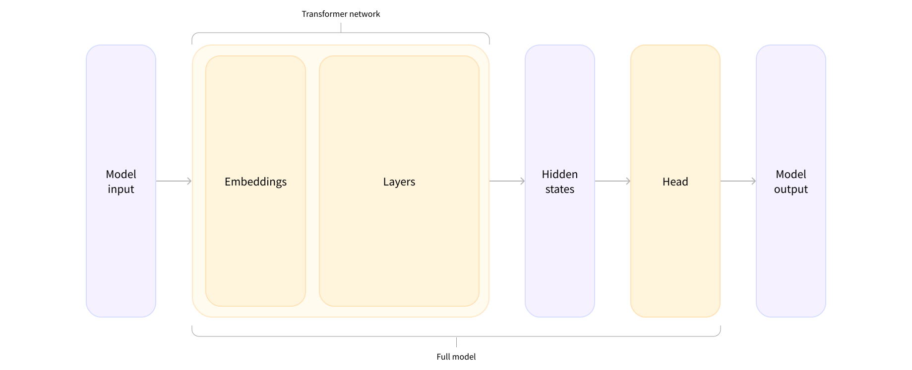

# NLPJourney


This repository is a collection of notes, code snippets, and resources for learning Natural Language Processing (NLP) I collected throughout my journey. The main goal is to have a reference guide for future projects and to share knowledge with others.

# Index

- [What is NLP?](#what-is-nlp)
- [Learnings](#learnings)
  - [Model heads: Making sense out of numbers](#model-heads-making-sense-out-of-numbers)
  - [Huggin Face storing](#huggin-face-storing)
  - [Tokenizers Algorithms](#tokenizers-algorithms)
- [Toolbox](#toolbox)
    - [Pipeline](#pipeline)
    - [Easy Baseline & Labeling](#easy-baseline--labeling)
    - [The Hugging Face Hub: Models](#the-hugging-face-hub-models)
    - [Sharing a Model at Hugging Face](#sharing-a-model-at-hugging-face)
    - [Accelerate](#accelerate)
    - [Dataset map() batched](#dataset-map-batched)
    - [Environment Impact](#environment-impact)
    - [Tools Table](#tools-table)
- [Useful Links](#useful-links)
- [To-Do](#to-do)
  - [Main NLP Tasks](#main-nlp-tasks)
  - [Advanced NLP Tasks](#advanced-nlp-tasks)
  - [Other](#other)
- [Credits](#credits)


# What is NLP?
NLP is a field of linguistics and machine learning focused on understanding everything related to human language. The aim of NLP tasks is not only to understand single words individually, but to be able to understand the context of those words.

The following is a list of common NLP tasks, with some examples of each:

- **Classifying whole sentences**: Getting the sentiment of a review, detecting if an email is spam, determining if a sentence is grammatically correct or whether two sentences are logically related or not
- **Classifying each word in a sentence**: Identifying the grammatical components of a sentence (noun, verb, adjective), or the named entities (person, location, organization)
- **Generating text content**: Completing a prompt with auto-generated text, filling in the blanks in a text with masked words
- **Extracting an answer from a text**: Given a question and a context, extracting the answer to the question based on the information provided in the context
- **Generating a new sentence from an input text**: Translating a text into another language, summarizing a text

NLP isn’t limited to written text though. It also tackles complex challenges in speech recognition and computer vision, such as generating a transcript of an audio sample or a description of an image.


# Learnings

## Model heads: Making sense out of numbers

`AutoModel` architecture contains only the base Transformer module: given some inputs, it outputs what we’ll call `hidden states`, also known as `features`. For each model input, we’ll retrieve a high-dimensional vector representing the contextual understanding of that input by the Transformer model.

```python
from transformers import AutoModel

checkpoint = "distilbert-base-uncased-finetuned-sst-2-english"
model = AutoModel.from_pretrained(checkpoint)
outputs = model(**inputs)
# outputs.last_hidden_state (batch_size, sequence_length, hidden_size)
```


The model heads take the high-dimensional vector of hidden states as input and project them onto a different dimension.



There are many different architectures available in Hugging Face Transformers, with each one designed around tackling a specific task. Here is a non-exhaustive list:

- `*Model` (retrieve the hidden states)
- `*ForCausalLM`
- `*ForMaskedLM`
- `*ForMultipleChoice`
- `*ForQuestionAnswering`
- `*ForSequenceClassification`
- `*ForTokenClassification`
- and others

If, for example, we need a model with a sequence classification head, to be able to classify the sentences as positive or negative, we won’t actually use the AutoModel class, but AutoModelForSequenceClassification.

```python
from transformers import AutoModel

checkpoint = "distilbert-base-uncased-finetuned-sst-2-english"
model = AutoModelForSequenceClassification.from_pretrained(checkpoint)
outputs = model(**inputs)
# outputs.logits (batch_size, num_labels)
```

## Huggin Face storing

### Models

When using `from_pretrained()`, the weights are downloaded and cached (so future calls to the  method won’t re-download them) in the cache folder, which defaults to `~/.cache/huggingface/transformers`. We can customize your cache folder by setting the `HF_HOME` environment variable.

### Data

When using `datasets.load_dataset()`, the datasets are downloaded and cached in the cache folder, which defaults to `~/.cache/huggingface/datasets`. We can customize your cache folder by setting the `HF_HOME` environment variable.

## Tokenizers Algorithms

| Model         | BPE                                                                          | WordPiece                                                                                                                                                          | Unigram                                                                                           |
|---------------|------------------------------------------------------------------------------|--------------------------------------------------------------------------------------------------------------------------------------------------------------------|---------------------------------------------------------------------------------------------------|
| Training      | Starts from a small vocabulary and learns rules to merge tokens              | Starts from a small vocabulary and learns rules to merge tokens                                                                                                    | Starts from a large vocabulary and learns rules to remove tokens                                  |
| Training step | Merges the tokens corresponding to the most common pair                      | Merges the tokens corresponding to the pair with the best score based on the frequency of the pair, privileging pairs where each individual token is less frequent | Removes all the tokens in the vocabulary that will minimize the loss computed on the whole corpus |
| Learns        | Merge rules and a vocabulary                                                 | Just a vocabulary                                                                                                                                                  | A vocabulary with a score for each token                                                          |
| Encoding      | Splits a word into characters and applies the merges learned during training | Finds the longest subword starting from the beginning that is in the vocabulary, then does the same for the rest of the word                                       | Finds the most likely split into tokens, using the scores learned during training                 |


# Toolbox

## Pipeline

Checkout `basics/hf_pipeline.ipynb` for examples of using Hugging Face's pipeline for NLP tasks. There are several tasks you can try out of the box without too much effort.

Check available pipelines [here](https://huggingface.co/docs/transformers/main_classes/pipelines)


## Easy Baseline & Labeling

For many NLP tasks, we can rely on pre-trained models that have been trained on large datasets. Leveraging zero-shot or few-shot capabilities of these models can provide a strong baseline for many tasks.

For example, for making a spam and mail classifier, we can just use a zero-shot classifier from Hugging Face Transformers library.

```python
from transformers import pipeline

oracle = pipeline(model="facebook/bart-large-mnli")
oracle(
    "I have a problem with my iphone that needs to be resolved asap!!",
    candidate_labels=["urgent", "not urgent", "phone", "tablet", "computer"],
)
"""
Output:
{
 'sequence': 'I have a problem with my iphone. Resolved asap!!',
 'labels': ['urgent', 'phone', 'not urgent', 'tablet', 'computer'],
 'scores': [0.504131, 0.479352, 0.013123621, 0.003235, 0.0022361]
}
"""
```

## The Hugging Face Hub: Models

The models in the Hub are not limited to Hugging Face Transformers or even NLP. There are models from [Flair](https://github.com/flairNLP/flair) and [AllenNLP](https://github.com/allenai/allennlp) for NLP, [Asteroid](https://github.com/asteroid-team/asteroid) and [pyannote](https://github.com/pyannote/pyannote-audio) for speech, and [timm](https://github.com/rwightman/pytorch-image-models) for vision, to name a few.


## Sharing a Model at Hugging Face

You can train you own model and share it at Hugging Face. You can find the instructions [here](https://huggingface.co/learn/nlp-course/chapter4/3?fw=pt#sharing-pretrained-models) and [here](https://huggingface.co/transformers/model_sharing.html). Also, information about building a model card [here](https://huggingface.co/learn/nlp-course/chapter4/4?fw=pt).


## Accelerate

We can easily [supercharge](https://huggingface.co/learn/nlp-course/chapter3/4?fw=pt#supercharge-your-training-loop-with-accelerate) our training loop with Hugging Face [Accelerate library](https://github.com/huggingface/accelerate). Checkout an example at `basics/hf_finetuning_pytorch_accelerate.ipynb`.

Then the main bulk of the work is done in the line that sends the dataloaders, the model, and the optimizer to `accelerator.prepare()`. This will wrap those objects in the proper container to make sure your distributed training works as intended. The remaining changes to make are removing the line that puts the batch on the device (again, if you want to keep this you can just change it to use `accelerator.device`) and replacing `loss.backward()` with `accelerator.backward(loss)`.

> In order to benefit from the speed-up offered by Cloud TPUs, we recommend padding your samples to a fixed length with the `padding="max_length"` and `max_length` arguments of the tokenizer.

Putting this in a train.py script will make that script runnable on any kind of distributed setup. To try it out in your distributed setup, run the command:

```bash
accelerate config
```

which will prompt you to answer a few questions and dump your answers in a configuration file used by this command:

```bash
accelerate launch train.py
```

which will launch the distributed training. You can find more examples in the Hugging Face [Accelerate repo](https://github.com/huggingface/accelerate/tree/main/examples).

## Dataset map() batched

Map method applies a custom processing function to each row in the dataset. **Should return a dictionary**. If the item has new columns/keys, they will be added to the dataset, if it has the same keys, it will be replaced. We can use the map method in batch mode with `Dataset.map(function, batched=True)`. For example:

```python
def lowercase_title(example):
    return {"title": example["title"].lower()}

my_dataset = my_dataset.map(lowercase_title)
```
The `Dataset.map()` method takes a batched argument that, if set to `True`, causes it to send a batch of examples to the map function at once (the batch size is configurable but defaults to 1,000). For instance, the previous map function that unescaped all the HTML took a bit of time to run (you can read the time taken from the progress bars). We can speed this up by **processing several elements at the same time** using a list comprehension.

When you specify `batched=True` the function receives a dictionary with the fields of the dataset, but **each value is now a list of values, and not just a single value**. The return value of `Dataset.map()` should be the same: a dictionary with the fields we want to update or add to our dataset, and a list of values. For example, here is another way to lowercase all titles, but using `batched=True`:

```python
def lowercase_title(batch):
    return {"title": [title.lower() for title in batch["title"]]}

my_dataset = my_dataset.map(lowercase_title, batched=True)
```


## Environment Impact

- [ML CO2 Impact]((https://mlco2.github.io/impact/)): Website to calculate the carbon footprint of your machine learning models. Is integrated with Hugging Face's model hub. To learn more about this, you can read this [blog post](https://huggingface.co/blog/carbon-emissions-on-the-hub) which will show you how to generate an `emissions.csv` file with an estimate of the footprint of your training, as well as the [documentation](https://huggingface.co/docs/hub/model-cards-co2) of Hugging Face Transformers addressing this topic.


## Tools Table

| Tool  | Description                                                                                                                                    | Tags                 |
|-------|------------------------------------------------------------------------------------------------------------------------------------------------|----------------------|
| [vLLM](https://docs.vllm.ai/en/latest/)  | vLLM is a fast and easy-to-use library for LLM inference and serving.                                                                          | LLM - Serving        |
| [LoRAX](https://loraexchange.ai/) | Serve thousands of fine-tuned models on a single GPU, dramatically reducing the cost of serving without compromising on throughput or latency. | LLM - LoRA - Serving |


# Useful Links

- [Dataset loading documentation](https://huggingface.co/docs/datasets/loading): Guide to learn how to load a dataset from: The Hub without a dataset loading script; Local loading script; Local files; In-memory data; Offline; A specific slice of a split. Audio, Image and Text datasets.


# To-Do

## Main NLP Tasks

- [ ] TF-IDF
- [ ] Sentiment Analysis
- [x] [Named Entity Recognition (Token Classification)](main_tasks/token_classification)
- [ ] Fine-tuning a masked language model
- [ ] Translation
- [ ] Summarization
- [ ] Question Answering
- [ ] Causal Language Modeling
- [ ] Text Generation: Free Form
- [ ] Text Generation: Structured
- [x] [Semantic Search](main_tasks/semantic_search)
- [ ] Retrieval Augmented Generation

## Advanced NLP Tasks

- [ ] Visual Document Understanding - Parsing: [Donut Tutorial](https://www.philschmid.de/fine-tuning-donut)

## Other

- [ ] [Large Language Model Course - Maxime Labonne](https://github.com/mlabonne/llm-course)
- [ ] [LLM Engineer's Handbook - Maxime Labonne](https://www.amazon.com/dp/1836200072?ref=cm_sw_r_cp_ud_dp_ZFR4XZPT7EY41ZE1M5X9&ref_=cm_sw_r_cp_ud_dp_ZFR4XZPT7EY41ZE1M5X9&social_share=cm_sw_r_cp_ud_dp_ZFR4XZPT7EY41ZE1M5X9)
- [ ] [Building LLMs for Production - Louis-François Bouchard](https://www.amazon.com/Building-LLMs-Production-Reliability-Fine-Tuning/dp/B0D4FFPFW8)


# Credits
## Courses

- [Hugging Face NLP Course](https://huggingface.co/learn/nlp-course)