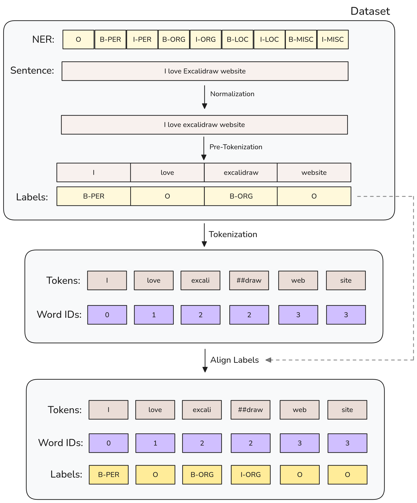

# Token Classification

Token classification is a generic task encompasses any problem that can be formulated as “attributing a label to each token in a sentence,”.

# Index

- [Key Techniques](#key-techniques)
- [Common Tasks](#common-tasks)
- [Example Projects](#example-projects)
- [Evaluation Metrics](#evaluation-metrics)
- [Projects](#projects)
  - [Named Entity Recognition (NER)](#ner)

## Key Techniques

The key techniques we are going to use are **Transformer-based models**: Pre-trained models like BERT, RoBERTa, and their variants have become state-of-the-art for many token classification tasks.

## Common Tasks

- **Named entity recognition (NER)**: Find the entities (such as persons, locations, or organizations) in a sentence. This can be formulated as attributing a label to each token by having one class per entity and one class for “no entity.”
- **Part-of-speech tagging (POS)**: Mark each word in a sentence as corresponding to a particular part of speech (such as noun, verb, adjective, etc.).
- **Chunking**: Find the tokens that belong to the same entity. This task (which can be combined with POS or NER) can be formulated as attributing one label (usually `B-`) to any tokens that are at the beginning of a chunk, another label (usually `I-`) to tokens that are inside a chunk, and a third label (usually `O`) to tokens that don’t belong to any chunk.
- **Sentiment Analysis at Token Level**: Determining the sentiment (positive, negative, neutral) of individual words or phrases within a larger text.

## Example Projects

 - Anonymizing text data: Replacing names, locations, or other sensitive information with generic labels.
 - Medical Entity Recognition: Identifying medical terms, diseases, treatments, and anatomical references in clinical notes or research papers.
- Social Media Monitoring: Detecting mentions of specific products, brands, or sentiments in tweets or social media posts.

## Evaluation Metrics

The common evaluation metrics for token classification tasks are:

- **Precision**: The proportion of true positive predictions among all positive predictions.
- **Recall**: The proportion of true positive predictions among all actual positive instances.
- **F1 Score**: The harmonic mean of precision and recall.
- **Accuracy**: The proportion of correct predictions among all predictions.

## Projects

### NER

Fine-tune a model (BERT) on a NER task, which will then be able to compute predictions.
The main considerations are:
- **Data preprocessing**: Usually we will have as dataset a set of labels matching words and categories. When we tokenize the text, the **words can be split into multiple tokens**, so we need to **adjust the labels** accordingly.

> Some researchers prefer to attribute only one label per word, and assign -100 to the other subtokens in a given word. This is to avoid long words that split into lots of subtokens contributing heavily to the loss. We can change the `align_labels_with_tokens` function to align labels with input IDs by following this rule.

Note that we are using words that are already normalized and splitted into words (pre-tokenized). To feed this into our tokenizer we need to warn it by setting `is_split_into_words=True` when calling the tokenizer.
